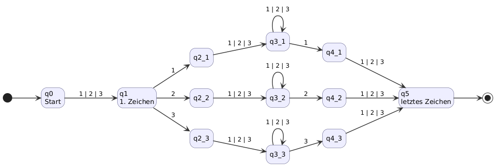

# Blatt 01: Reguläre Sprachen

## A1.1: Sprachen von regulären Ausdrücken (1P)

regex: $a\ +\ a\ (a\ +\ b)^*\ a$  welche Sprache?
> **_Antwort:_**
>
> Das Wort "a" (Teil vor dem +) oder Wärter beginnend mit "a", endend mit "a" und dazwischen beliebig viele oder keine "a" oder "b" 
>
> { a } oder { a (a oder b oder nichts)* a} 

## A1.2: Bezeichner in Programmiersprachen (3P)

Bezeichneraufbau:

- Variablennamen beginnen mit **V**(global) oder **v**(lokal)
- Funktions- und Methodenparameter mit **p**, KLassenparameter
  (Definition von Vererbung) mit **P**
- Weitere müssen mit (a-z, A-Z) beginnen
- folgen dürfen Buchstaben, Ziffern und Untersreich
- dürfen nicht mit Unterstrich enden
- müssen mindestens zwei Zeichen haben

### regulärer Ausdruck + 2 Beispiele

> **_Antwort:_**
>
> $L=(V+v+P+p+a-z+A-Z)(a-z+A-Z+0-9+\_)^*(a-z+A-Z+0-9)$
>
> **Beispiele:**
>
> |Bezeichner| Teil | Teil des regex|
> |-|-|-|
> |Vcount1|V| $(V+v+P+p+a-z+A-Z)$ |
> ||count| $(a-z+A-Z+0-9+\_)^*$ |
> ||1| $(a-z+A-Z+0-9)$
> ||||
> |p_name_3|p| $(V+v+P+p+a-z+A-Z)$ |
> ||\_name\_| $(a-z+A-Z+0-9+\_)^*$ |
> ||3| $(a-z+A-Z+0-9)$
>

### DFA + 2 Beispiele

> **_Antwort:_**
>
> 
>
> **Beispiele:**
> 
> * Vcount1 = start -> q0 --"V"--> q1 --"o"--> q2 --"unt2"--> q2 -> ende
>
> 
>
> * p_name_3 = start -> q0 --"p"--> q1 --"\_"--> q3 --"n"--> q2 --"ame"--> q2 --"\_"--> q3 --"3"--> q2 --> ende
>
> 

### reguläre Grammatik + 2 beispiele

> **_Antwort:_**
>
> N = {S, A, B, C}
>
> T = {{a-z + A-Z}: buchstabe, {0-9}: zahl, "_": unterstrich}
>
> S = S
>
> P = { 
> * S -> fA          f ∈ { V, v, P, p } ∪ buchstabe
> * A -> (buchstabe) B | (zahl) B | (unterstrich) C
> * B -> (buchstabe) B | (zahl) B | ε
> * C -> (buchstabe) B | (zahl) B | (unterstrich) C
>
> } (Produktionen)
>
> **Beispiel**
> 
> Vcount1
>
> S -> "V"A -> "Vc"B -> "Vco"B -> "Vcou"B -> "Vcoun"B -> "Vcount"B -> "Vcount1"B -> "Vcount1ε"
>
> p_name_3
>
> S -> "p"A -> "p_"C -> "p_n"B -> "p_na"B -> "p_nam"B -> "p_name"B -> "p_name_"C -> "p_name_3"B -> "p_name_3ε"

## A1.3: Gleitkommazahlen in Programmiersprachen (2P)

### Aufbau Gleitkommazahlen in Python und Java.
> **_Antwort:_** 
>
> _Java:_  
> *  optionales Vorzeichen
> *  mind. eine Ziffer vor dem Dezimalpunkt
> *  optionaler Dezimalteil (Punkt + Nachkommastelle)
> *  optionaler Exponentialteil (opt. Vorzeichen, Ziffern )
>
> _Python:_ float
> * optionales Vorzeichen
> * mind. eine Ziffer vor dem Dezimalpunkt
> * optionaler Dezimalteil (Punkt + Nachkommastelle)

### Regex, DFA, Grammatik

> #### Java
> 
> * Regex: $[-,+]?[0-9]^+(.[0-9]*)?((e+E)[+-][0-9]^*)?$
>
> * Beispiele:
>
> | Zahl | Teil | Teil des regex |
> |-|-|-|
> | -12.34e+5 | - | [+,-]? |
> | 12 | [0-9]^+ |
> | .34 | (.[0-9]^+)? |
> | e+5 | ((e+E)([+,-])?[0-9]^*)? |
> ||||
> | 3.1415 | 3 | [0-9]^+ |
> | .1415 | (.[0-9]^+)? |
> | (kein Exponent) |  |

>
> * DFA
>
> 
>
> hier muss bei q0-q1 das plus noch mitgegeben werden 
>
> * Beispiele:
>
> * * _3.1415_ : start --> q0 --"3"--> q2 --"."--> q3 --"1415"--> q4 --> ende
>
> * *  _-12.34e+5_ : start --> q0 --"-"--> q1 --"1"--> q2 --"2"--> q2 --"."--> q3 --"34"--> q4 --"e"--> q5 --"+"--> q6 --"5"--> q7 --> ende
>
> * Grammatik
>
> N = {S, A, B, C, D, E, F}
>
> T = {{+,-}: vorzeichen, {0-9}: zahl, ".": punkt, {e, E}: expo}
>
> S = S
>
> P = { 
> * S -> (vorzeichen) A | A
> * A -> (zahl) B
> * B -> (zahl) B | (punkt) C | (expo) D | ε
> * C -> (zahl) C | (expo) D | ε
> * D -> (vorzeichen) E | E
> * E -> (zahl) F 
> * F -> (zahl) F | ε
>
> } (Produktionen)
>
> **Beispiel**
> 
> 3.1415
>
> S --> A --> 3 B --> 3 . C --> 3 . 1 C --> 3 . 14 C --> 3 . 141 C --> 3 . 1415 C --> 3 . 1415 ε
>
> -12.34e+5
>
> S --> - A --> - 1 B --> - 12 B --> - 12 . C --> - 12 . 3 C --> - 12 . 34 C --> - 12 . 34 e D --> - 12 . 34 e + E --> - 12 . 34 e + 5 F --> - 12 . 34 e + 5 ε
> 

> #### Python
> 
> * Regex: $-?[0-9]^+(.[0-9]*)?$
>
> * Beispiele:
>
> | Zahl | Teil | Teil des regex |
> |-|-|-|
> | -12.34 | - | -? |
> | 12 | [0-9]^+ |
> | .34 | (.[0-9]^+)? |
> ||||
> | 3.1415 | 3 | [0-9]^+ |
> | .1415 | (.[0-9]^+)? |
>
> * DFA
>
> 
>
> * Beispiele:
>
> * * _3.1415_ : start --> q0 --"3"--> q2 --"."--> q3 --"1415"--> q4 --> ende
>
> * *  _-12.34_ : start --> q0 --"-"--> q1 --"1"--> q2 --"2"--> q2 --"."--> q3 --"34"--> q4 --> ende 
>
> * Grammatik
>
> * * N = {S, A, B, C }
>
> * * T = {{-}: vorzeichen, {0-9}: zahl, ".": punkt}
>
> * * S = S
>
> * * P = { 
> * * * S -> (vorzeichen) A | A
> * * * A -> (zahl) B
> * * * B -> (zahl) B | (punkt) C  | ε
> * * * C -> (zahl) C | ε
>
> } (Produktionen)
>
> **Beispiel**
> 
> * 3.1415
>
> * * S --> A --> 3 B --> 3 . C --> 3 . 1 C --> 3 . 14 C --> 3 . 141 C --> 3 . 1415 C --> 3 . 1415 ε
>
> * -12.34
>
> * * S --> - A --> - 1 B --> - 12 B --> - 12 . C --> - 12 . 3 C --> - 12 . 34 C --> - 12 . 34 ε
> 

## A1.4: Mailadressen? (1P)

Warum $`(a-z)^+@(a-z).(a-z)`$ ungeeignet für emails?
> * erlaubt keine großbuchstaben
> * keine zahlen
> * nur ein kleiner buchstabe nach @ und nach .
> * keine sonderzeichen erlaubt
> * -> zu wenig möglichkeiten, eine sole email wirds nicht geben

$`a + b + c + c + \ldots + z`$ ist besser, aber immer noch nicht
richtig. Warum?

> * Weil weiterhin keine Großbuchstaben akzeptiert werden
> * c ist doppelt
> * theoretisch erlauben wir damit  a, b, c, "...", z, also nicht das alphabet

Verbessert
> $((a-z, A-Z)^*, [0-9]^+)^+@(a-z)^*.(a-z)^*$ 
>
> weiterhin nicht optimal, da keine sonderzeichen, könnte mit zahlen beginnen, etc

## A1.5: Der zweitletzte Buchstabe (1P)

> $`\Sigma = \lbrace 1,2,3 \rbrace`$, wort[länge-2] === wort[1]

## A1.6: Sprache einer regulären Grammatik (2P)

S → a A

A → d B | b A | c A

B → a C | b C | c A

C → ε

> * wörter beginnen mit a
> * haben mindestens 2 zeichen
> * bestehen aus {a,b,c,d}
>
> $(a(b+c)+(dc))^*d(a+b)$
>
> 

