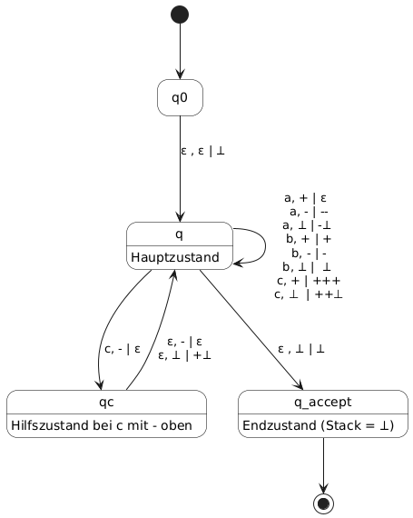
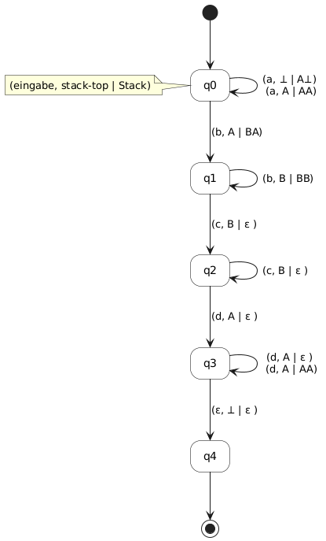
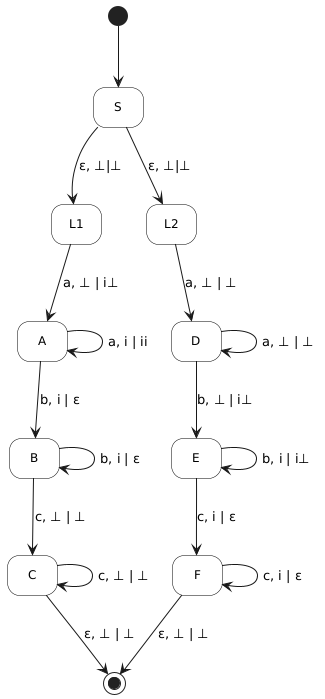

# Blatt 02: CFG

## A2.1: PDA (3P)
deterministischen PDA, Sprache:
``` math
L = \lbrace w \in \lbrace a, b, c \rbrace^* \; | \; w \; \text{hat doppelt so viele a's wie c's} \rbrace
```




Bei einem c werden zwei "+" in den Stack geschrieben, ein a baut eins dieser + wieder ab. so wird ein c mit 2 a ausgeglichen

$P=(Q, \Sigma, \Gamma, \delta, q_0, \perp, F)$

$Q = \{q0, q, qc, q\_accept\}$ (Startzustand, Hauptzustand, Hilfszustand, Akzeptierender Zustand)

$\Sigma = \{a, b, c \}$

$\Gamma = \{\perp, +, - \}$

$\delta = \delta : Q \times (\Sigma \cup \{\varepsilon\}) \times \Gamma -> P(Q \times \Gamma^*)$

$q_0 = q0$

$\perp = \perp$ 

$F = \{q\_accept\}$


Beschreiben Sie Schritt für Schritt, wie der PDA die Eingaben *bcaba*
und *bccac* abarbeitet.

### bcaba

|Eingabe|Zustand|Regel|Stack|
|----|----|-|--:|
|ε|q0 -> q|(init)|⟂|
|b|q -> q|(b, ⟂ \| ⟂)| ⟂|
|c|q -> q|(c, ⟂ \| + + ⟂)|+ + ⟂|
|a|q -> q|(a, + \| ε)|+ ⟂|
|b|q -> q|(b, + \| +)|+ ⟂|
|a|q -> q|(a, + \| ε)|⟂|
|ε|q -> q_accept|(ε, ⟂ \| ⟂)|⟂|


### bccac

|Eingabe|Zustand|Regel|Stack|
|----|----|-|--:|
|ε|q0 -> q|(init)|⟂|
|b|q -> q|(b, ⟂ \| ⟂)| ⟂|
|c|q -> q|(c, ⟂ \| + + ⟂)|+ +⟂|
|c|q -> q|(c, + \| + + +)| + + + + ⟂|
|a|q -> q|(a, + \| ε)| + + + ⟂|
|c|q -> q|(c, + \| + + +)|+ + + + + ⟂|
|ε| q -> Fehler| es gibt keinen übergang (ε, +)| |

-> Wort wird nicht akzeptiert, entspricht nicht der Sprache


## A2.2: Akzeptierte Sprache (2P)



Es handelt sich um einen Nichtdeterministischen PDA, da in q3 bei gleicher Eingabe und gleichem Stack-Top zwei verschiedene Aktionen ausgeführt werden können, er also mehr als eine Aktion für den Zustand (d, A) hat

 Geben Sie das 7-Tupel des PDa an. Welche
Sprache akzeptiert er?

$P=(Q, \Sigma, \Gamma, \delta, q_0, \perp, F)$

$Q = \{q_0, q_1, q_2, q_3, q_4\}$ 

$\Sigma = \{a, b, c, d \}$

$\Gamma = \{\perp, A, B\}$

$\delta = \delta : Q \times (\Sigma \cup \{\varepsilon\}) \times \Gamma -> P(Q \times \Gamma^*)$

$q_0 = q0$

$\perp = \perp$ 

$F = \{q_4\}$

Sprache: 
A und B sind die "Zählvariablen" -> Zwei Exponenten
Beliebig viele As, Anders Beliebig viele Bs, C's in der Menge der B's, D's in der Menge der A's

$ L = \{a^mb^nc^nd^m \| m \ge 1, n \ge 1\}$

## A2.3: Kontextfreie Sprache (2P)

Welche Sprache ?
```
Nichtterminale = {Statement, Condition, ...}
Terminale = {"if", "else", ...}
Produktionen = {
    Statement => ("if" Condition Statement) | ("if" Condition Statement "else" Statement)
    Contidion => ...
 }
Startzustand = Statement
```

Erzeugt verschachtlte "if" Statements mit optionalen "else", auch verschachtelt


Mehrdeutig
```
1)    S
      |-If ... (Statement1)
      |-----------If ... (Statement2) else (Statement3)
      -> if ... (if ... Statement2 else Statement3)

2)    S
      |-If ... (Statement1) else (Statement2)
      |------------If...(Statement3) 
      -> if ... (if ...Statement3) else Statement2
```

"If ... if ... Statement else Statement " kann durch beide ableitungsbäume produziert werden

## A2.4: Kontextfreie Grammatik (3P)

Entwickeln Sie eine kontextfreie Grammatik für die Sprache


``` math
L = \lbrace a^ib^jc^k \; | \; i = j \lor j = k \rbrace
```

$ L = L_1 \lor L_2$

$ L_1 = \{ a^ib^ic^k \| i, k \ge 0\}$ gleich viele a und b

$ L_2 = \{ a^ib^kc^k \| i, k \ge 0\}$ gleich viele b und c

Produktionen:

$ S -> L_1 \| L_2$

---
$ L_1 -> A B$

$ A -> a A b   | \epsilon$

$ B -> c B | \epsilon$

---
$ L_2 -> C D$

$ C -> a C | \epsilon$

$ D -> b D c   | \epsilon$


Die L ist mehrdeutig für alle i = j = k, da diese sich über L1 und L2 ableiten lassen

Grammatik:

$G = ($

 $   \{S, L_1, L_2, A, B, C, D \},$

 $   \{a,b,c\}, $

$   \{
      (s-> L_1\|L_2), 
     (L_1 -> A B), 
      (A -> a Ab \| \epsilon),
      (B-> cB \| \epsilon),
      (L_2 -> CD ),
      (C -> aC \| \epsilon),
      ( D -> b D c \| \epsilon)
  \},$

$   S$

$   )$



$P = (Q, \Sigma, \Gamma, \delta, q_0, \perp, F$

$Q = \{S, L1, L2, A, B, C, D, E, F\}$

$\Sigma = \{a, b, c\}$

$\Gamma = i, \perp$

$\delta = \delta : Q \times (\Sigma \cup \{\varepsilon\}) \times \Gamma -> P(Q \times \Gamma^*)$

$q_0 = S$

$\perp = \perp$

$F = \{C, F\}$
